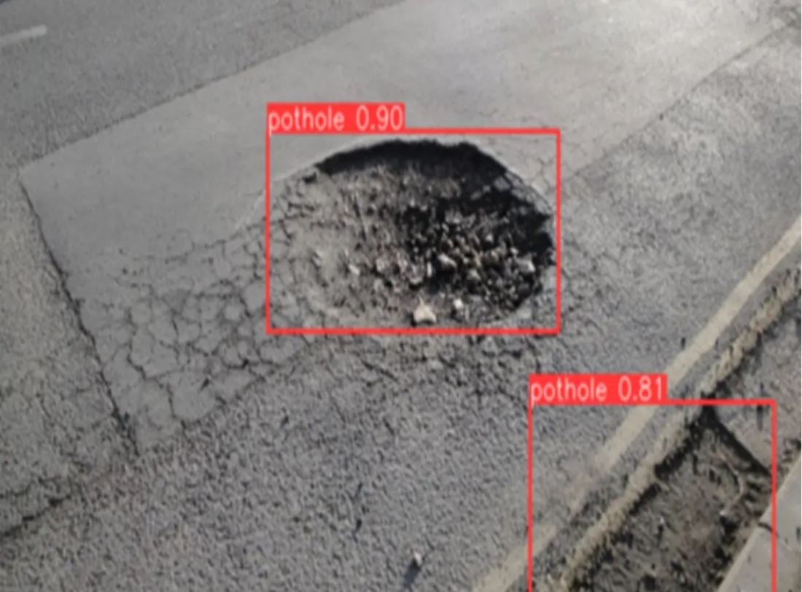

# 드론 기반 포트홀 자동 감지 시스템

## 📋 프로젝트 개요

도로 위 위험 요소인 포트홀을 신속하고 정확하게 감지하여 사고 위험을 줄이고, 도시부 도로의 안전한 관리체계를 구축하는 것이 목표입니다.

## 🎯 목표

- 드론 및 YOLO 모델을 활용한 포트홀 자동 감지 시스템 개발
- 드론 촬영을 통해 도로 위 포트홀 위치 및 크기 실시간 파악
- 정확도 향상, 속도 향상, 인력 의존도 감소
- 촬영 데이터는 GPS와 함께 전송하여 빠른 보수 작업 가능

## 🔍 포트홀이란?

도로 표면이 움푹 파이는 현상으로 노면 노후화, 시공 불량, 집중호우 등으로 발생합니다.
- 타이어 파손, 차량 하부 손상, 2차 추돌 등 심각한 사고 유발 요인
- 연 평균 21만 건 이상 발생 (2019년 국토교통부 기준)
- 대부분 야간·장마철에 발견 어려움 → 인명·재산 피해로 이어짐

## 📊 기존 방식 vs 드론 방식 비교

| 방식 | 특징 | 단점 |
| --- | --- | --- |
| 택시 | 버튼으로 수동 신고 | 정확도 낮고 운전자 의존 |
| 버스 | 진동 센서로 탐지 | 과속방지턱 오탐지, 고비용 |
| 블랙박스 | 영상 기반 탐지 | 속도에 따라 탐지 성능 저하 |
| **드론** | 공중 촬영 + 자동 분석 | 넓은 범위 빠르게 탐지, 정확도 높음 |

## 🛠️ 기술 스택

- **딥러닝 프레임워크**: YOLOv8 (Ultralytics)
- **프로그래밍 언어**: Python
- **주요 라이브러리**:
  - OpenCV (이미지 처리)
  - PyTorch (딥러닝)
  - NumPy, Pandas (데이터 처리)
  - Matplotlib (시각화)

## 🤖 YOLO (You Only Look Once)란?

YOLO는 실시간 객체 탐지(Real-time Object Detection)를 위한 딥러닝 모델입니다.

### YOLO의 특징

- **단일 단계 탐지 (One-Stage Detection)**: 이미지를 한 번만 스캔하여 객체를 탐지하므로 매우 빠른 속도
- **실시간 처리**: 초당 수십 프레임 처리 가능하여 실시간 비디오 분석에 적합
- **높은 정확도**: 최신 버전인 YOLOv8은 이전 버전 대비 정확도와 속도 모두 향상
- **다양한 객체 탐지**: 사람, 차량, 동물 등 다양한 객체를 동시에 탐지 가능

### YOLO의 작동 원리

1. **이미지 분할**: 입력 이미지를 격자(grid)로 나눔
2. **바운딩 박스 예측**: 각 격자 셀에서 객체의 위치와 크기를 예측
3. **클래스 분류**: 탐지된 객체의 클래스를 분류
4. **비최대 억제 (NMS)**: 중복된 탐지 결과를 제거하여 최종 결과 도출

## 🎯 사용한 모델: YOLOv8s

본 프로젝트에서는 **YOLOv8s (Small)** 모델을 사용했습니다.

### YOLOv8 모델 변형 비교

YOLOv8은 성능과 속도에 따라 여러 변형을 제공합니다:

| 모델 | 파라미터 수 | 속도 | 정확도 | 용도 |
|------|------------|------|--------|------|
| YOLOv8n (Nano) | ~3.2M | 가장 빠름 | 낮음 | 모바일/엣지 디바이스 |
| **YOLOv8s (Small)** | **~11.2M** | **빠름** | **중간** | **일반적인 실시간 탐지** |
| YOLOv8m (Medium) | ~25.9M | 중간 | 높음 | 서버/데스크톱 |
| YOLOv8l (Large) | ~43.7M | 느림 | 매우 높음 | 고정밀도 탐지 |
| YOLOv8x (XLarge) | ~68.2M | 가장 느림 | 최고 | 연구/벤치마크 |

### YOLOv8s를 선택한 이유

- **균형잡힌 성능**: 정확도와 속도의 최적 균형
- **실시간 처리**: 드론 촬영 영상의 실시간 분석에 적합
- **효율적인 리소스 사용**: 상대적으로 적은 파라미터로 빠른 학습 및 추론
- **충분한 정확도**: 포트홀 탐지에 필요한 정확도를 제공

### 모델 아키텍처

YOLOv8s는 다음과 같은 구조를 가집니다:
- **Backbone**: CSPDarknet53 기반의 특징 추출 네트워크
- **Neck**: PANet (Path Aggregation Network) 구조
- **Head**: Decoupled Head로 분류와 회귀 작업 분리

## 📊 데이터셋 정보

### 데이터셋 출처

- **데이터셋**: Roboflow Pothole Dataset
- **제공자**: brad-dwyer (Roboflow Universe)
- **라이선스**: ODbL v1.0
- **데이터셋 URL**: https://universe.roboflow.com/brad-dwyer/pothole-voxrl/dataset/1

### 데이터셋 구성

```
데이터셋/
├── train/          # 학습용 이미지 및 라벨
├── valid/          # 검증용 이미지 및 라벨
└── test/           # 테스트용 이미지 및 라벨
```

### 데이터셋 특징

- **클래스 수**: 1개 (pothole)
- **이미지 형식**: 다양한 해상도의 도로 이미지
- **라벨 형식**: YOLO 형식 (바운딩 박스 좌표)
- **데이터 분할**: Train/Validation/Test 세트로 구성

### 데이터 전처리

- **이미지 크기**: 640x640 픽셀로 리사이즈
- **데이터 증강**: Mosaic, Flip, HSV 조정 등 자동 적용
- **정규화**: 이미지 픽셀 값을 0-1 범위로 정규화

## 📁 프로젝트 구조

```
Yolo_프로젝트/
├── README.md                    # 프로젝트 설명서
├── 영상분석&포트홀.ipynb        # 메인 분석 노트북
├── data.yaml                    # YOLO 데이터셋 설정 파일
├── best.pt                      # 학습된 모델 가중치
├── image.png                    # 포트홀 감지 결과 이미지
├── POTHOLE 발표대본.hwp         # 발표 자료
├── POTHOLE_보고서.hwp           # 프로젝트 보고서
├── pothole-프로젝트 (1).pptx   # 프로젝트 발표 PPT
└── road-20251215T062258Z-1-001.zip  # 데이터셋
```

## 🚀 사용 방법

### 1. 환경 설정

```bash
pip install ultralytics opencv-python pandas numpy matplotlib
```

### 2. 모델 학습

노트북(`영상분석&포트홀.ipynb`)에서 다음 코드를 실행:

```python
from ultralytics import YOLO

# 모델 로드
model = YOLO('yolov8s.yaml').load('yolov8s.pt')

# 학습
model.train(
    data='data.yaml',
    epochs=100,
    pretrained='yolov8s.pt',
    batch=-1,
    imgsz=640,
    patience=100,
    project='pothole_pt'
)
```

### 3. 포트홀 감지

```python
from ultralytics import YOLO
import cv2

# 학습된 모델 로드
model = YOLO('best.pt')

# 이미지 읽기
source = cv2.imread('path/to/image.jpg')

# 추론 실행
results = model(source)

# 결과 시각화
res_plotted = results[0].plot()
```

## 🎓 모델 학습 설정

### 학습 하이퍼파라미터

| 파라미터 | 값 | 설명 |
|---------|-----|------|
| **모델** | YOLOv8s | Small 버전 사용 |
| **Epochs** | 100 | 최대 학습 에포크 수 |
| **Batch Size** | -1 (자동) | GPU 메모리에 맞게 자동 설정 |
| **Image Size** | 640 | 입력 이미지 크기 (640x640) |
| **Patience** | 100 | 조기 종료를 위한 patience 값 |
| **Learning Rate** | 0.01 | 초기 학습률 (자동 조정) |
| **Optimizer** | AdamW | 최적화 알고리즘 |
| **Device** | CUDA (GPU) | Tesla T4 GPU 사용 |

### 학습 환경

- **플랫폼**: Google Colab
- **GPU**: Tesla T4 (15GB VRAM)
- **프레임워크**: PyTorch 2.1.0 + CUDA 12.1
- **Python 버전**: 3.10.12

## 📈 성능 지표

### 추론 성능

실제 테스트 이미지(448x640)에서 측정된 성능:

| 지표 | 값 | 설명 |
|------|-----|------|
| **전처리 시간** | 3.0ms | 이미지 전처리 소요 시간 |
| **추론 시간** | 21.1ms | 모델 추론 소요 시간 |
| **후처리 시간** | 2.2ms | 결과 후처리 소요 시간 |
| **총 처리 시간** | **~26.3ms** | **전체 처리 시간** |
| **FPS (Frames Per Second)** | **~38 FPS** | **초당 처리 가능한 프레임 수** |

### 감지 성능

- **실시간 처리 가능**: 38 FPS로 실시간 비디오 스트림 처리 가능
- **다중 객체 탐지**: 단일 이미지에서 여러 포트홀 동시 탐지 가능
- **신뢰도**: 높은 신뢰도 점수 (0.81 ~ 0.90)로 포트홀 탐지

### 모델 크기

- **모델 파일**: `best.pt` (학습된 가중치)
- **파일 크기**: 약 수십 MB (정확한 크기는 학습 결과에 따라 다름)

## 📈 결과

학습된 YOLOv8 모델을 사용하여 도로 이미지에서 포트홀을 자동으로 감지할 수 있습니다.

### 감지 결과 예시

모델은 도로 이미지에서 포트홀을 정확하게 탐지하며, 각 포트홀에 대해:
- 바운딩 박스 좌표 (xMin, yMin, xMax, yMax)
- 신뢰도 점수 (Confidence Score, 예: 0.90, 0.81)
- 클래스 정보 (pothole)

를 제공합니다.

#### 결과 이미지

다음은 실제 도로 이미지(448x640)에서 포트홀을 감지한 결과입니다:



**감지 결과 상세:**
- **상단 포트홀**: 신뢰도 0.90으로 감지된 대형 포트홀
- **하단 포트홀**: 신뢰도 0.81로 감지된 선형 포트홀
- **총 탐지 개수**: 8개의 포트홀을 한 이미지에서 탐지

모델은 노면의 균열과 파손된 아스팔트 영역을 정확하게 식별하여 빨간색 바운딩 박스로 표시합니다.

### 성능 요약

✅ **실시간 처리**: 38 FPS로 실시간 비디오 분석 가능  
✅ **높은 정확도**: 신뢰도 0.81 이상으로 안정적인 탐지  
✅ **다중 탐지**: 단일 이미지에서 여러 포트홀 동시 탐지  
✅ **빠른 속도**: 26ms 이내로 이미지 분석 완료

## 📝 참고 자료

- [Ultralytics YOLOv8 문서](https://docs.ultralytics.com/)
- 데이터셋: Roboflow Pothole Dataset

## 👥 팀

2022년 대학교 프로젝트

## 📄 라이선스

이 프로젝트는 교육 목적으로 제작되었습니다.

